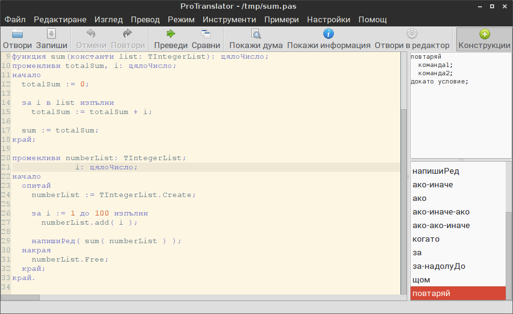

# ProTranslator
ProTranslator е програма, която позволява превода на програмен код
на български и по този начин улеснява разбирането на кода от ученици,
тепърва започващи да програмират. Интерфейсът на програмата е пригоден
за начинаещи в програмирането. Изключително полезно за хора с ниски или
никакви познания по английски език.

### Лиценз
ProTranslator e свободен софтуер с отворен код, лицензиран под [GNU GPLv2](http://www.gnu.org/licenses/gpl-2.0.html#SEC1).

